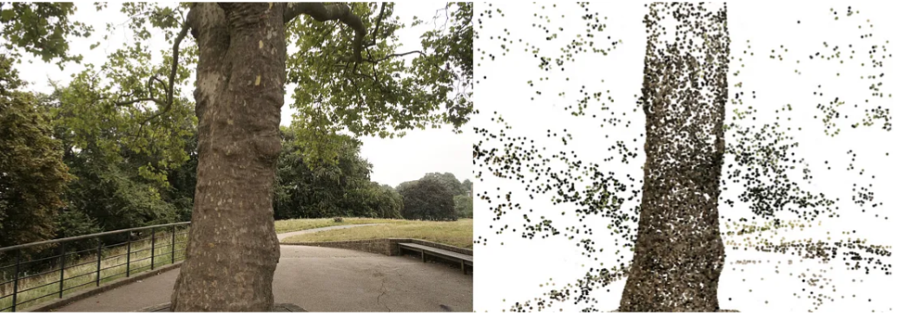

# A Simple Introduction to 3D Gaussian Splatting

> see: https://medium.com/towards-data-science/a-python-engineers-introduction-to-3d-gaussian-splatting-part-1-e133b0449fc6  
> see: https://github.com/dcaustin33/intro_to_gaussian_splatting  

## 3D Points and 2D projection
To begin, we use COLMAP, a software that extracts points consistently seen across multiple images using Structure from Motion (SfM). SfM essentially identifies points (e.g., the top right edge of a doorway) found in more than 1 picture. By matching these points across different images, we can estimate the depth of each point in 3D space. This closely emulates how human stereo vision works, where depth is perceived by comparing slightly different views from each eye. Thus, SfM generates a set of 3D points, each with x, y, and z coordinates, from the common points found in multiple images giving us the “structure” of the scene.

In this tutorial we will use a prebuilt COLMAP scan that is available for [download here](https://storage.googleapis.com/gresearch/refraw360/360_extra_scenes.zip) (Apache 2.0 license). Specifically we will be using the Treehill folder within the downloaded dataset.

<div style="text-align:center"></div>

<br>

The folder consists of three files corresponding to the camera parameters, the image parameters and the actual 3D points. 

See the dir info:
```plain
(jupyter_py312_pt2.x) ccj@desktop754:/media/disk1_hdd_4T/datasets/3dgs-demo/360_extra_scenes/treehill/sparse$ tree
.
└── 0
    ├── cameras.bin
    ├── images.bin
    └── points3D.bin

2 directories, 3 files
```

We will start with the 3D points. The points file consists of thousands of points in 3D along with associated colors. The points are centered around what is called the world origin, essentially their `x`, `y`, or `z` coordinates are based upon where they were observed in reference to this world origin. The exact location of the world origin isn’t crucial for our purposes, so we won’t focus on it as it can be any arbitrary point in space. Instead, its only essential to know where you are in the world in relation to this origin. That is where the image file becomes useful!

Broadly speaking the image file tells us where the image was taken and the `orientation` of the camera, both in relation to the world origin. Therefore, the key parameters we care about are the `quaternion vector` and the `translation vector`. The quaternion vector describes the rotation of the camera in space using 4 distinct float values that can be used to form a rotation matrix (3Blue1Brown has a great video explaining exactly what quaternions are [here](https://www.youtube.com/watch?v=d4EgbgTm0Bg)). The translation vector then tells us the camera’s position relative to the origin. Together, these parameters form the extrinsic matrix, with the quaternion values used to compute a 3x3 rotation matrix (see [formula](https://automaticaddison.com/how-to-convert-a-quaternion-to-a-rotation-matrix/)) and the translation vector appended to this matrix.

To convert COLMAP points to a 2D image, we first project them to camera coordinates using the extrinsic matrix, and then project them to 2D using the intrinsic matrix. However, an important detail is that we use homogeneous coordinates for this process. The extrinsic matrix is 4x4, while our input points are 3x1, so we stack a 1 to the input points to make them 4x1.

Here’s the process step-by-step:

Transform the points to camera coordinates: multiply the 4x4 extrinsic matrix by the 4x1 point vector.
Transform to image coordinates: multiply the 3x4 intrinsic matrix by the resulting 4x1 vector.
This results in a 3x1 matrix. To get the final 2D coordinates, we divide by the third coordinate of this 3x1 matrix and obtain an x and y coordinate in the image! You can see exactly how this should look about for image number 100 and the code to replicate the results is shown below.

```python
def get_intrinsic_matrix(
    f_x: float, f_y: float, c_x: float, c_y: float
) -> torch.Tensor:
    """
    Get the homogenous intrinsic matrix for the camera
    """
    return torch.Tensor(
        [
            [f_x, 0, c_x, 0],
            [0, f_y, c_y, 0],
            [0, 0, 1, 0],
        ]
    )


def get_extrinsic_matrix(R: torch.Tensor, t: torch.Tensor) -> torch.Tensor:
    """
    Get the homogenous extrinsic matrix for the camera
    """
    Rt = torch.zeros((4, 4))
    Rt[:3, :3] = R
    Rt[:3, 3] = t
    Rt[3, 3] = 1.0
    return Rt

def project_points(
    points: torch.Tensor, intrinsic_matrix: torch.Tensor, extrinsic_matrix: torch.Tensor
) -> torch.Tensor:
    """
    Project the points to the image plane

    Args:
        points: Nx3 tensor
        intrinsic_matrix: 3x4 tensor
        extrinsic_matrix: 4x4 tensor
    """
    homogeneous = torch.ones((4, points.shape[0]), device=points.device)
    homogeneous[:3, :] = points.T
    projected_to_camera_perspective = extrinsic_matrix @ homogeneous
    projected_to_image_plane = (intrinsic_matrix @ projected_to_camera_perspective).T # Nx4
    
    x = projected_to_image_plane[:, 0] / projected_to_image_plane[:, 2]
    y = projected_to_image_plane[:, 1] / projected_to_image_plane[:, 2]
    return x, y


colmap_path = "treehill/sparse/0"
reconstruction = pycolmap.Reconstruction(colmap_path)

points3d = reconstruction.points3D
images = read_images_binary(f"{colmap_path}/images.bin")
cameras = reconstruction.cameras

all_points3d = []
all_point_colors = []

for idx, point in enumerate(points3d.values()):
    if point.track.length() >= 2:
        all_points3d.append(point.xyz)
        all_point_colors.append(point.color)

gaussians = Gaussians(
    torch.Tensor(all_points3d), 
    torch.Tensor(all_point_colors),
    model_path="point_clouds"
)

# we will examine the 100th image
image_num = 100    
image_dict = read_image_file(colmap_path)
camera_dict = read_camera_file(colmap_path)

# convert quaternion to rotation matrix
rotation_matrix = build_rotation(torch.Tensor(image_dict[image_num].qvec).unsqueeze(0))
translation = torch.Tensor(image_dict[image_num].tvec).unsqueeze(0)
extrinsic_matrix = get_extrinsic_matrix(
    rotation_matrix, translation
)
focal_x, focal_y = camera_dict[image_dict[image_num].camera_id].params[:2]
c_x, c_y = camera_dict[image_dict[image_num].camera_id].params[2:4]
intrinsic_matrix = get_intrinsic_matrix(focal_x, focal_y, c_x, c_y)

points = project_points(gaussians.points, intrinsic_matrix, extrinsic_matrix)
```

To review, we can now take any set of 3D points and project where they would appear on a 2D image plane as long as we have the various location and camera parameters we need! With that in hand we can move forward with understanding the “gaussian” part of gaussian splatting below.

## 3DGS

One slight change that we will make here is that we are going to use perspective projection that utilizes a different intrinsic matrix than the one shown above. However, the two are equivalent when projecting a point to 2D and I find the first method introduced above far easier to understand, however we change our method in order to replicate, in python, as much of the author’s code as possible. Specifically our “internal” matrix will now be given by the OpenGL projection matrix shown here and the order of multiplication will now be `points @ external.transpose() @ internal`.

$$
\begin{bmatrix}
\frac{2n}{r-l} & 0 & \frac{r+l}{r-l} & 0 \\
0 & \frac{2n}{t-b} & \frac{t+b}{t-b} & 0 \\
0 & 0 & -\frac{f+n}{f-n} & -\frac{2fn}{f-n} \\
0 & 0 & -1 & 0
\end{bmatrix}
$$

For those curious to know about this new internal matrix (otherwise feel free to skip this paragraph) `r` and `l` are the clipping planes of the right and left sides, essentially what points could be in view with regards to the width of the photo, and `t` and `b` are the top and bottom clipping planes. `n` is the near clipping plane (where points will be projected to) and `f` is the far clipping plane. For more information I have found scratchapixel’s chapters here to be quite informative (https://www.scratchapixel.com/lessons/3d-basic-rendering/perspective-and-orthographic-projection-matrix/opengl-perspective-projection-matrix.html). This also returns the points in `normalized device coordinates` (between -1 and 1) and which we then project to `pixel coordinates`. Digression aside the task remains the same, take the point in 3D and project onto a 2D image plane. However, in this part of the tutorial we are now using Gaussians instead of a points.

```python
def getIntinsicMatrix(
    focal_x: torch.Tensor,
    focal_y: torch.Tensor,
    height: torch.Tensor,
    width: torch.Tensor,
    znear: torch.Tensor = torch.Tensor([100.0]),
    zfar: torch.Tensor = torch.Tensor([0.001]),,
) -> torch.Tensor:
    """
    Gets the internal perspective projection matrix
    
    znear: near plane set by user
    zfar: far plane set by user
    fovX: field of view in x, calculated from the focal length
    fovY: field of view in y, calculated from the focal length
    """
    fovX = torch.Tensor([2 * math.atan(width / (2 * focal_x))])
    fovY = torch.Tensor([2 * math.atan(height / (2 * focal_y))])
    
    tanHalfFovY = math.tan((fovY / 2))
    tanHalfFovX = math.tan((fovX / 2))

    top = tanHalfFovY * znear
    bottom = -top
    right = tanHalfFovX * znear
    left = -right

    P = torch.zeros(4, 4)

    z_sign = 1.0

    P[0, 0] = 2.0 * znear / (right - left)
    P[1, 1] = 2.0 * znear / (top - bottom)
    P[0, 2] = (right + left) / (right - left)
    P[1, 2] = (top + bottom) / (top - bottom)
    P[3, 2] = z_sign
    P[2, 2] = z_sign * zfar / (zfar - znear)
    P[2, 3] = -(zfar * znear) / (zfar - znear)
    return P
```

A 3D gaussian splat consists of `x, y, and z` coordinates as well as the associated covariance matrix. As noted by the authors: 
> “An obvious approach would be to directly optimize the covariance matrix Σ to obtain 3D gaussians that represent the radiance field. However, covariance matrices have physical meaning only when they are positive semi-definite. For our optimization of all our parameters, we use gradient descent that cannot be easily constrained to produce such valid matrices, and update steps and gradients can very easily create invalid covariance matrices.”

Therefore, the authors use a decomposition of the covariance matrix that will always produce `positive semi definite` covariance matrices. Given a scaling matrix $S$ and rotation matrix $R$, we can find the corresponding covariance matrix $\Sigma$:

$$\Sigma = RSS^TR^T$$

According to the paper:
> To allow independent optimization of both factors, we store them separately: a 3D vector $s$ for scaling and a quaternion $q$ to represent rotation. These can be trivially converted to their respective matrices and combined, making sure to normalize $q$ to obtain a valid unit quaternion. Note one must normalize the quaternion vector before converting to a rotation matrix in order to obtain a valid rotation matrix. 

Therefore in our implementation a gaussian point consists of the following parameters, 
- coordinates (3x1 vector), 
- quaternions (4x1 vector), 
- scale (3x1 vector) and 
- a final float value relating to the opacity (how transparent the splat is). 

Now all we need to do is optimize these $11$ parameters to get our scene — simple right!

Well it turns out it is a little bit more complicated than that. If you remember from high school mathematics, the strength of a gaussian at a specific point is given by the equation:

$$ G(\bf{x}) = \exp{(-\frac{1}{2}(\bf{x}-\bf{\mu})^T\Sigma^{-1}(\bf{x}- \bf{\mu}))}$$

However, we care about the strength of 3D gaussians in 2D, ie., in the image plane. But you might say, we know how to project points to 2D! Despite that, we have not yet gone over projecting the covariance matrix to 2D and so we could not possibly find the inverse of the 2D covariance matrix if we have not yet to find the 2D covariance matrix.

Now this is the fun part (depending on how you look at it). EWA Splatting, a paper reference by the 3D gaussian splatting authors, shows exactly how to project the 3D covariance matrix to 2D. However, this assumes knowledge of a `Jacobian` affine transformation matrix, which we compute below. 

According to the 3DGS paper:
> However, we need to project our 3D Gaussians to 2D for rendering.
Zwicker et al. [2001a] demonstrate how to do this projection to image space. Given a viewing transformation $W$ the covariance matrix $\Sigma'$ in camera coordinates is given as follows:
> $$ \Sigma' = JW\Sigma W^T J^T $$
> where $J$ is the Jacobian of the affine approximation of the projective transformation.

Where W is the $3 \times 3$ transformation matrix representing the viewing transform and $J$ is the $2 \times 3$ "Jacobian of the affine approximation of the projective transformation". With large focal lengths and small gaussians, the approximation should work well.

I find code most helpful when walking through a difficult concept and thus I have provided some below in order to exemplify how to go from a 3D covariance matrix to 2D.


$$J = \begin{bmatrix} f_x / z & 0 & -f_x x/z^2 \\\ 0 & f_y/z & -f_yy/z^2 \end{bmatrix}$$


```python
def compute_2d_covariance(
    points: torch.Tensor,
    external_matrix: torch.Tensor,
    covariance_3d: torch.Tensor,
    tan_fovY: torch.Tensor,
    tan_fovX: torch.Tensor,
    focal_x: torch.Tensor,
    focal_y: torch.Tensor,
) -> torch.Tensor:
    """
    Compute the 2D covariance matrix for each gaussian
    """
    points = torch.cat(
        [points, torch.ones(points.shape[0], 1, device=points.device)], dim=1
    )
    points_transformed = (points @ external_matrix)[:, :3]
    limx = 1.3 * tan_fovX
    limy = 1.3 * tan_fovY
    x = points_transformed[:, 0] / points_transformed[:, 2]
    y = points_transformed[:, 1] / points_transformed[:, 2]
    z = points_transformed[:, 2]
    x = torch.clamp(x, -limx, limx) * z
    y = torch.clamp(y, -limy, limy) * z

    J = torch.zeros((points_transformed.shape[0], 2, 3), device=covariance_3d.device)
    J[:, 0, 0] = focal_x / z
    J[:, 0, 2] = -(focal_x * x) / (z**2)
    J[:, 1, 1] = focal_y / z
    J[:, 1, 2] = -(focal_y * y) / (z**2)

    # transpose as originally set up for perspective projection
    # so we now transform back
    W = external_matrix[:3, :3].T

    return J @ W @ covariance_3d @ W.T @ J.transpose(1, 2)
```


First of all, `tan_fovY` and `tan_fovX` are the tangents of half the field of view angles. We use these values to clamp our projections, preventing any wild, off-screen projections from affecting our render. One can derive the Jacobian from the transformation from 3D to 2D as given with our initial forward transform introduced above, but I have saved you the trouble and show the expected derivation above. Lastly, if you remember we transposed our rotation matrix above in order to accommodate a reshuffling of terms and therefore we transpose back on the penultimate line before returning the final covariance calculation. As the EWA splatting paper notes, we can ignore the third row and column seeing as we only care about the 2D image plane. You might wonder, why couldn’t we do that from the start? Well, the covariance matrix parameters will vary depending on which angle you are viewing it from as in most cases it will not be a perfect sphere! Now that we’ve transformed to the correct viewpoint, the covariance z-axis info is useless and can be discarded.

Given that we have the 2D covariance matrix we are close to being able to calculate the impact each gaussian has on any random pixel in our image, we just need to find the inverted covariance matrix. Recall again from linear algebra that to find the inverse of a 2x2 matrix you only need to find the determinant and then do some reshuffling of terms. Here is some code to help guide you through that process as well.

```python
def compute_inverted_covariance(covariance_2d: torch.Tensor) -> torch.Tensor:
    """
    Compute the inverse covariance matrix

    For a 2x2 matrix
    given as
    [[a, b],
     [c, d]]
     the determinant is ad - bc

    To get the inverse matrix reshuffle the terms like so
    and multiply by 1/determinant
    [[d, -b],
     [-c, a]] * (1 / determinant)
    """
    determinant = (
        covariance_2d[:, 0, 0] * covariance_2d[:, 1, 1]
        - covariance_2d[:, 0, 1] * covariance_2d[:, 1, 0]
    )
    determinant = torch.clamp(determinant, min=1e-3)
    inverse_covariance = torch.zeros_like(covariance_2d)
    inverse_covariance[:, 0, 0] = covariance_2d[:, 1, 1] / determinant
    inverse_covariance[:, 1, 1] = covariance_2d[:, 0, 0] / determinant
    inverse_covariance[:, 0, 1] = -covariance_2d[:, 0, 1] / determinant
    inverse_covariance[:, 1, 0] = -covariance_2d[:, 1, 0] / determinant
    return inverse_covariance
```

And tada, now we can compute the pixel strength for every single pixel in an image. However, doing so is extremely slow and unnecessary. For example, we really don’t need to waste computing power figuring out how a splat at (0,0) affects a pixel at (1000, 1000), unless the covariance matrix is massive. Therefore, the authors make a choice to calculate what they call the “radius” of each splat. As seen in the code below we calculate the eigenvalues along each axis (remember, eigenvalues show variation). Then, we take the square root of the largest eigenvalue to get a standard deviation measure and multiply it by 3.0, which covers 99.7% of the distribution within 3 standard deviations. This radius helps us figure out the minimum and maximum x and y values that the splat touches. When rendering, we only compute the splat strength for pixels within these bounds, saving a ton of unnecessary calculations. Pretty smart, right?

```python
def compute_extent_and_radius(covariance_2d: torch.Tensor):
    mid = 0.5 * (covariance_2d[:, 0, 0] + covariance_2d[:, 1, 1])
    det = covariance_2d[:, 0, 0] * covariance_2d[:, 1, 1] - covariance_2d[:, 0, 1] ** 2
    intermediate_matrix = (mid * mid - det).view(-1, 1)
    intermediate_matrix = torch.cat(
        [intermediate_matrix, torch.ones_like(intermediate_matrix) * 0.1], dim=1
    )

    max_values = torch.max(intermediate_matrix, dim=1).values
    lambda1 = mid + torch.sqrt(max_values)
    lambda2 = mid - torch.sqrt(max_values)
    # now we have the eigenvalues, we can calculate the max radius
    max_radius = torch.ceil(3.0 * torch.sqrt(torch.max(lambda1, lambda2)))

    return max_radius

```

All of these steps above give us our preprocessed scene that can then be used in our render step. As a recap we now have the points in 2D, colors associated with those points, covariance in 2D, inverse covariance in 2D, sorted depth order, the minimum x, minimum y, maximum x, maximum y values for each splat, and the associated opacity. With all of these components we can finally move onto rendering an image!


## Reference
[1]: Kerbl, Bernhard, et al. “3d gaussian splatting for real-time radiance field rendering.” ACM Transactions on Graphics 42.4 (2023): 1–14.

[2]: Zwicker, Matthias, et al. “EWA splatting.” IEEE Transactions on Visualization and Computer Graphics 8.3 (2002): 223–238.